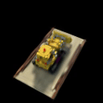

# Improved Dynamic Gaussian Reconstruction with Multi-Scene Training

This project is forked from [Deformable 3D Gaussians for High-Fidelity Monocular Dynamic Scene Reconstruction](https://github.com/ingra14m/Deformable-3D-Gaussians).




This repository contains the implementation for the project **Improved Dynamic Gaussian Reconstruction with Multi-Scene Training**. In this project, we aim to develop a model to predict Gaussians for a dynamic monocular scene to allow novel view synthesis.

This branch is the implmentation for **UNet-based** model. For **MVSplat-based model**, please refer to the `MVSplat` branch.

## Dataset

In our project, we mainly use the synthetic dataset from [D-NeRF](https://www.albertpumarola.com/research/D-NeRF/index.html).


## Run

### Environment

This project is an incomplete clone of the original one. To set up the environment, please set up an environment using the original repository:
```shell
git clone https://github.com/yuhaozhang7/DynamicGaussianReconstruction.git --recursive
cd DynamicGaussianReconstruction

conda create -n deformable_gaussian_env python=3.7
conda activate deformable_gaussian_env

# install pytorch
pip install torch==1.13.1+cu116 torchvision==0.14.1+cu116 --extra-index-url https://download.pytorch.org/whl/cu116

# install dependencies
pip install -r requirements.txt
```

### Train

**D-NeRF:**

```shell
python train.py -s path/to/your/d-nerf/dataset -m output/exp-name --eval --is_blender
```


### Render & Evaluation

```shell
python render.py -m output/exp-name --mode render --reverse True
python metrics.py -m output/exp-name
```

Use `--reverse` to specify whether to reverse the order of inputs to the model.

We have modified the code to support several modes for rendering:

- `render`: render all the test images
- `time`: time interpolation tasks for D-NeRF dataset
- `all`: time and view synthesis tasks for D-NeRF dataset
- `view`: view synthesis tasks for D-NeRF dataset
- `original`: time and view synthesis tasks for real-world dataset


### Using our checkpoints

Please download the checkpoint models from 
[Google Drive](https://drive.google.com/drive/folders/16d6MSmLQSwDm04G-4os-QtZUPnxvELGA?usp=sharing).

Then, change the `source_path` option in `cfg_args` to the true path to D-NeRF dataset, and you can evaluate using the commands above.